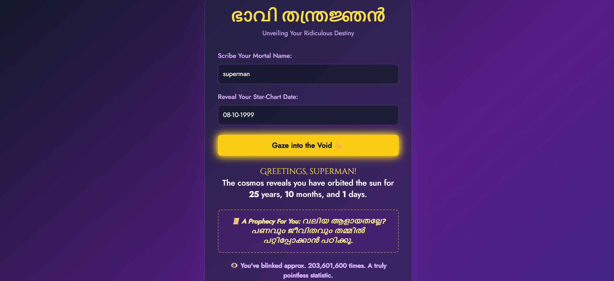
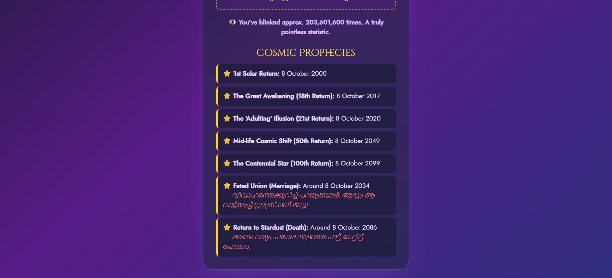

# ഭാവി തന്ത്രജ്ഞൻ 🎯

## Basic Details
### Team Name: Ctrl Z

### Team Members
- Team Lead: Rejin Dev P - GEC Kozhikode
- Member 2: Salman A - GEC Kozhikode

### Project Description
A quirky web app that calculates your exact age, predicts funny life milestones like marriage and death dates with sarcastic Malayalam messages, which remind you of your cosmic journey.

### The Problem (that doesn't exist)
People need an entertaining way to face their inevitable fate — because why just calculate age when you can roast your life milestones too?

### The Solution (that nobody asked for)
We built a "Fate Calculator" that not only tells your age down to days and months but also humorously predicts life events with witty Malayalam messages. 

## Technical Details
### Technologies/Components Used
For Software:
- Languages used: HTML, CSS (TailwindCSS), JavaScript
- Frameworks used: None (Vanilla JS)
- Libraries used
    - TailwindCSS (for styling)
    - canvas-confetti (for celebratory effects)
- Tools used: VS Code, Git, Chrome DevTools, **Vercel (for deployment)**

### Implementation
For Software:
# Installation
 No installation required. Just download or clone the repo.

# Run
Check out the live project here: [ഭാവി തന്ത്രജ്ഞൻ](https://fatecalculator-pi.vercel.app/)

### Project Documentation
For Software:

# Screenshots

*User inputs name and date of birth.*

*Sarcastic life milestones and age calculation results displayed.*

*A visual highlight*

## Team Contributions
- Rejin Dev P: Developer, UI design, and troubleshooting
- Salman A: Sarcastic Malayalam message creation, confetti and logic implementation

---
Made with ❤️ at TinkerHub Useless Projects 

